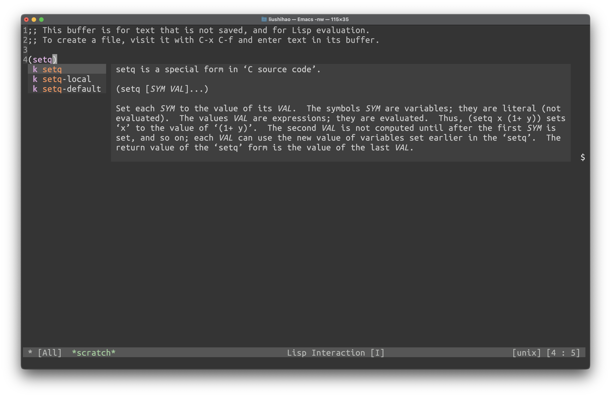

### Introduction
This package provides an informative popup that shows the docstring of the
candidates in [company-mode](https://github.com/company-mode/company-mode) menu.
Unlike [company-box](https://github.com/sebastiencs/company-box),
[company-posframe](https://github.com/tumashu/company-posframe),
[company-quickhelp](https://github.com/company-mode/company-quickhelp),
```company-tip``` works in terminal Emacs, as it depends on Emacs' overlay
feature.

### Installation
Clone this repository:

``` shell
git clone --depth=1 https://github.com/liushihao456/company-tip.git
```

Then add company-tip.el to your load-path:

``` emacs-lisp
(add-to-list 'load-path "/path/to/company-tip/")
(add-hook 'company-mode-hook 'company-tip-mode)
```

